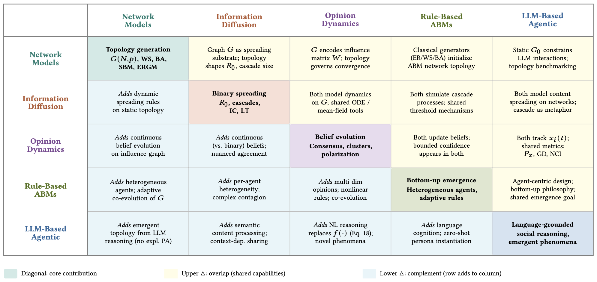

# Awesome Social Network Simulation: From Small Worlds to Agentic AI

[](https://awesome.re)
[](https://github.com/tamlhp/awesome-sns/stargazers)


A collection of academic articles, published methodology, and datasets on the subject of **Social Network Simulation** from classical models to LLM-based agentic simulation.

<!-- This README follows the manuscript structure directly: five paradigm sections with one paper table per paradigm, followed by dedicated dataset/benchmark and evaluation-metric sections. The survey spans 97 papers across 1951-2026, five application domains, 38 implementations, 21 benchmarks/datasets, and 22 evaluation metrics. -->

<!-- The manuscript metadata currently still contains placeholder ACM DOI and venue fields, so this repository intentionally avoids unverified publication claims until a public paper link is finalized. -->

- [Taxonomy](#taxonomy)
- [Network Models](#network-models)
- [Information Diffusion](#information-diffusion)
- [Opinion Dynamics](#opinion-dynamics)
- [Rule-Based Agent-Based Models](#rule-based-agent-based-models)
- [LLM-Based Agentic Simulation](#llm-based-agentic-simulation)
- [Datasets and Benchmarks](#datasets-and-benchmarks)
- [Evaluation Metrics](#evaluation-metrics)
- [Contributing](#contributing)

<!-- ## Citation

If you use this repository, please cite the survey manuscript. A public DOI or finalized venue entry will be added once the paper metadata is finalized.

```bibtex
@misc{pham2026social-network-simulation,
  title = {A Survey of Social Network Simulation: From Small Worlds to Agentic AI},
  author = {Pham, Trinh and Nguyen, Quoc Viet Hung and Yin, Hongzhi and Nguyen, Thanh Tam},
  year = {2026},
  note = {Survey manuscript},
  url = {https://github.com/tamlhp/awesome-sns}
}
``` -->

## Taxonomy



The survey organizes the field into five paradigm families:

- **Network Models**: topology generation and structural analysis for synthetic social graphs.
- **Information Diffusion**: epidemic, cascade, influence, rumor, and control models.
- **Opinion Dynamics**: averaging, bounded-confidence, polarization, and echo-chamber models.
- **Rule-Based Agent-Based Models**: heterogeneous bottom-up simulation with explicit agent rules.
- **LLM-Based Agentic Simulation**: persona-grounded, memory-enabled, language-driven social agents.

Each table below is grounded in the manuscript citations and keeps the paper title, year, category, and publication source visible for quick scanning.

## Network Models

| Paper | Year | Category | Venue |
| --- | --- | --- | --- |
| On Random Graphs I | 1959 | Random Graph Models | Publicationes Mathematicae Debrecen |
| The Structure and Function of Complex Networks | 2003 | Random Graph Models | SIAM Review |
| The Small World Problem | 1967 | Small-World Networks | Psychology Today |
| Collective dynamics of `small-world' networks | 1998 | Small-World Networks | Nature |
| Emergence of Scaling in Random Networks | 1999 | Scale-Free Networks | Science |
| Maximizing the Spread of Influence through a Social Network | 2003 | Scale-Free Networks | KDD |
| Social network analysis and agent-based modeling in social epidemiology | 2012 | Exponential random graph models (ERGMs) | Epidemiol. Perspect. Innov. |
| Network segregation in a model of misinformation and fact-checking | 2016 | Attribute-driven generators | Journal of Computational Social Science |
| Homophily in An Artificial Social Network of Agents Powered By Large Language Models | 2023 | Attribute-driven generators | British Journal of Psychology |
| Diffusion of Innovations | 1962 | Attribute-driven generators | Free Press of Glencoe |
| Social Network Effects on the Extent of Innovation Diffusion: A Computer Simulation | 1997 | Attribute-driven generators | Organization Science |

## Information Diffusion

| Paper | Year | Category | Venue |
| --- | --- | --- | --- |
| Diffusion of Innovations | 1962 | Information Diffusion | Free Press of Glencoe |
| Simulation Investigation of Rumor Propagation in Microblogging Community | 2011 | Epidemic Compartment Models | Computer Engineering |
| SEIR Model of Rumor Spreading in Online Social Network with Varying Total Population Size | 2017 | Epidemic Compartment Models | Communications in Theoretical Physics |
| SIHR rumor spreading model in social networks | 2012 | Epidemic Compartment Models | Physica A: Statistical Mechanics and its Applications |
| ILSR rumor spreading model with degree in complex network | 2019 | Epidemic Compartment Models | Physica A |
| Dynamical analysis of a IWSR rumor spreading model with considering the self-growth mechanism and indiscernible degree | 2019 | Epidemic Compartment Models | Physica A: Statistical Mechanics and its Applications |
| The stochastic evolution of a rumor spreading model with two distinct spread inhibiting and attitude adjusting mechanisms in a homogeneous social network | 2020 | Epidemic Compartment Models | Physica A |
| CSRT rumor spreading model based on complex network | 2021 | Epidemic Compartment Models | International Journal of Intelligent Systems |
| Threshold Models of Collective Behavior | 1978 | Cascade Models: Independent Cascade and Linear Threshold | American Journal of Sociology |
| A Theory of Fads, Fashion, Custom, and Cultural Change as Informational Cascades | 1992 | Cascade Models: Independent Cascade and Linear Threshold | Journal of Political Economy |
| Maximizing the Spread of Influence through a Social Network | 2003 | Cascade Models: Independent Cascade and Linear Threshold | KDD |
| A game theoretical approach to broadcast information diffusion in social networks | 2011 | Cascade Models: Independent Cascade and Linear Threshold | Spring Simulation Multiconference |
| Influential Neighbours Selection for Information Diffusion in Online Social Networks | 2012 | Cascade Models: Independent Cascade and Linear Threshold | 2012 21st International Conference on Computer Communications and Networks (ICCCN) |
| How to Identify an Infection Source With Limited Observations | 2013 | Cascade Models: Independent Cascade and Linear Threshold | IEEE J. Sel. Top. Signal Process. |
| INFORMATION DIFFUSION IN FACEBOOK-LIKE SOCIAL NETWORKS UNDER INFORMATION OVERLOAD | 2013 | Cascade Models: Independent Cascade and Linear Threshold | International Journal of Modern Physics C |
| A SIMULATION-BASED APPROACH TO ANALYZE THE INFORMATION DIFFUSION IN MICROBLOGGING ONLINE SOCIAL NETWORK | 2013 | Cascade Models: Independent Cascade and Linear Threshold | - |
| Users' mobility enhances information diffusion in online social networks | 2021 | Cascade Models: Independent Cascade and Linear Threshold | Inf. Sci. |
| Information diffusion model for spread of misinformation in online social networks | 2013 | Competitive and Rumor Dynamics | ICACCI |
| Measuring trustworthiness of information diffusion by risk discovery process in social networking services | 2013 | Competitive and Rumor Dynamics | Quality & Quantity |
| Network segregation in a model of misinformation and fact-checking | 2016 | Competitive and Rumor Dynamics | Journal of Computational Social Science |
| Stability analysis and control models for rumor spreading in online social networks | 2017 | Competitive and Rumor Dynamics | International Journal of Modern Physics C |
| Global dynamics analysis and control of a rumor spreading model in online social networks | 2019 | Competitive and Rumor Dynamics | Physica A: Statistical Mechanics and its Applications |
| Optimal Control of Rumor Spreading Model on Homogeneous Social Network with Consideration of Influence Delay of Thinkers | 2019 | Competitive and Rumor Dynamics | Differential Equations and Dynamical Systems |
| The impact of group propagation on rumor spreading in mobile social networks | 2018 | Competitive and Rumor Dynamics | Physica A: Statistical Mechanics and its Applications |
| Rumor Spreading Model Considering Individual Activity and Refutation Mechanism Simultaneously | 2020 | Competitive and Rumor Dynamics | IEEE Access |
| Dynamical behaviors and control measures of rumor-spreading model in consideration of the infected media and time delay | 2021 | Competitive and Rumor Dynamics | Information Sciences |
| The Spread of True and False News Online | 2018 | Competitive and Rumor Dynamics | Science |

## Opinion Dynamics

| Paper | Year | Category | Venue |
| --- | --- | --- | --- |
| A formal theory of social power | 1956 | Averaging Models: French-DeGroot and Friedkin-Johnsen | Psychological Review |
| Reaching a Consensus | 1974 | Averaging Models: French-DeGroot and Friedkin-Johnsen | Journal of the American Statistical Association |
| Social Influence and Opinions | 1990 | Averaging Models: French-DeGroot and Friedkin-Johnsen | Journal of Mathematical Sociology |
| Extending the Hegselmann-Krause Model of Opinion Dynamics to include AI Oracles | 2025 | Averaging Models: French-DeGroot and Friedkin-Johnsen | arXiv preprint arXiv:2502.19701 |
| Mixing beliefs among interacting agents | 2000 | Bounded Confidence: Deffuant and Hegselmann-Krause | Advances in Complex Systems |
| Opinion dynamics and bounded confidence: models, analysis and simulation | 2002 | Bounded Confidence: Deffuant and Hegselmann-Krause | J. Artif. Soc. Soc. Simul. |
| Progressive Information Polarization in a Complex-Network Entropic Social Dynamics Model | 2019 | Bounded Confidence: Deffuant and Hegselmann-Krause | IEEE Access |
| Modeling Public Opinion Polarization in Group Behavior by Integrating SIRS-Based Information Diffusion Process | 2020 | Bounded Confidence: Deffuant and Hegselmann-Krause | Complexity |
| Spiral of Silence in the Social Media Era: A Simulation Approach to the Interplay Between Social Networks and Mass Media | 2019 | Discrete and Stochastic Models | Communication Research |
| Opinion Dynamics and Collective Risk Perception: An Agent-Based Model of Institutional and Media Communication About Disasters | 2021 | Extensions and Modern Directions | Journal of Artificial Societies and Social Simulation |

## Rule-Based Agent-Based Models

| Paper | Year | Category | Venue |
| --- | --- | --- | --- |
| Micromotives and Macrobehavior | 1978 | Schelling segregation | W. W. Norton & Company |
| Growing Artificial Societies: Social Science from the Bottom Up | 1996 | Sugarscape | MIT Press |
| An Agent-Based Model of Urgent Diffusion in Social Media | 2013 | Urgent diffusion | J. Artif. Soc. Soc. Simul. |
| Agent Based Simulation of Bot Disinformation Maneuvers in Twitter | 2019 | Bot-driven disinformation | WSC |
| The Spread of Behavior in an Online Social Network Experiment | 2010 | Complex contagion | Science |
| Collective dynamics of `small-world' networks | 1998 | Complex contagion | Nature |
| Effect of Seeding Strategy on the Efficiency of Brand Spreading in Complex Social Networks | 2022 | Other ABM diffusion studies | Frontiers in Psychology |
| Large-Scale Multi-agent-Based Modeling and Simulation of Microblogging-Based Online Social Network | 2013 | Other ABM diffusion studies | mAbs |
| WES: Agent-based User Interaction Simulation on Real Infrastructure | 2020 | Other ABM diffusion studies | Proceedings of the IEEE/ACM 42nd International Conference on Software Engineering Workshops |
| Why Do People Use Social Media? Agent-Based Simulation and Population Dynamics Analysis of the Evolution of Cooperation in Social Media | 2012 | Other ABM diffusion studies | 2012 IEEE/WIC/ACM International Conferences on Web Intelligence and Intelligent Agent Technology |
| The (Mis)Information Game: A social media simulator | 2024 | Other ABM diffusion studies | Behavior Research Methods |
| Simulating and evaluating generative modeling and collaborative filtering in complex social networks | 2019 | Other ABM diffusion studies | CCS |
| Policy simulation for promoting residential PV considering anecdotal information exchanges based on social network modelling | 2018 | Other ABM diffusion studies | Applied Energy |
| Discrete Event System Specification-based framework for modeling and simulation of propagation phenomena in social networks: application to the information spreading in a multi-layer social network | 2019 | DEVS-based scheduling | SIMULATION |
| Social network analysis and agent-based modeling in social epidemiology | 2012 | Real-infrastructure simulation | Epidemiol. Perspect. Innov. |
| NetLogo | 1999 | Implementation Frameworks | - |
| MASON: A Multiagent Simulation Environment | 2005 | Implementation Frameworks | Simulation |
| Complex adaptive systems modeling with Repast Simphony | 2013 | Implementation Frameworks | Complex Adapt. Syst. Model. |
| Utilizing Python for Agent-Based Modeling: The Mesa Framework | 2020 | Implementation Frameworks | SCS |
| A Survey of Agent-Based Approach of Complex Networks | 2016 | Implementation Frameworks | Ekonomik Yaklasim |
| Which Models Are Used in Social Simulation to Generate Social Networks? A Review of 17 Years of Publications in JASSS | 2015 | Implementation Frameworks | Proceedings of the 2015 Winter Simulation Conference |

## LLM-Based Agentic Simulation

| Paper | Year | Category | Venue |
| --- | --- | --- | --- |
| Social Simulacra: Creating Populated Prototypes for Social Computing Systems | 2022 | Agent Architecture for Social Simulation | UIST |
| Generative agents: Interactive simulacra of human behavior | 2023 | Agent Architecture for Social Simulation | UIST |
| ElectionSim: Massive Population Election Simulation Powered by Large Language Model Driven Agents | 2024 | Persona and Identity Grounding | arXiv preprint arXiv:2410.20746 |
| User Behavior Simulation with Large Language Model-based Agents | 2025 | Persona and Identity Grounding | TOIS |
| Humanoid Agents: Platform for Simulating Human-like Generative Agents | 2023 | Persona and Identity Grounding | EMNLP |
| S3: Social-network Simulation System with Large Language Model-Empowered Agents | 2023 | Memory: Episodic, Semantic, and Reflective | arXiv preprint arXiv:2307.14984 |
| Y Social: an LLM-powered Social Media Digital Twin | 2024 | Memory: Episodic, Semantic, and Reflective | arXiv preprint arXiv:2409.07925 |
| War and peace (waragent): Large language model-based multi-agent simulation of world wars | 2023 | Planning and Goal-Directed Action | arXiv preprint arXiv:2311.17227 |
| Oasis: Open agent social interaction simulations with one million agents | 2024 | Planning and Goal-Directed Action | arXiv preprint arXiv:2411.11581 |
| Theory of Mind for Multi-Agent Collaboration via Large Language Models | 2023 | Planning and Goal-Directed Action | EMNLP |
| Simulating Opinion Dynamics with Networks of LLM-based Agents | 2024 | Multi-Agent Coordination and Communication | Findings of the ACL: NAACL |
| AI Metropolis: Scaling Large Language Model-based Multi-Agent Simulation with Out-of-order Execution | 2025 | Multi-Agent Coordination and Communication | MLSys |
| Simulating Social Media Using Large Language Models to Evaluate Alternative News Feed Algorithms | 2023 | Multi-Agent Coordination and Communication | arXiv preprint arXiv:2310.05984 |
| GA-S3: Comprehensive Social Network Simulation with Group Agents | 2025 | Multi-Agent Coordination and Communication | Findings of the Association for Computational Linguistics: ACL 2025 |
| Exploring Collaboration Mechanisms for LLM Agents: A Social Psychology View | 2024 | Multi-Agent Coordination and Communication | ACL |
| Large Language Model-driven Multi-Agent Simulation for News Diffusion Under Different Network Structures | 2024 | Exogenous static networks | arXiv preprint arXiv:2410.15557 |
| Emergence of Scale-Free Networks in Social Interactions among Large Language Models | 2023 | Emergent networks | arXiv preprint arXiv:2312.06619 |
| Homophily in An Artificial Social Network of Agents Powered By Large Language Models | 2023 | Emergent networks | British Journal of Psychology |
| Network Formation and Dynamics Among Multi-LLMs | 2025 | Emergent networks | PNAS Nexus |
| [RumorSphere: A Framework for Million-scale Agent-based Dynamic Simulation of Rumor Propagation](https://arxiv.org/abs/2509.02172) | 2025 | Hybrid topology with adaptive role switching | - |
| BotSim: LLM-Powered Malicious Social Botnet Simulation | 2025 | Action spaces | AAAI |
| The Stepwise Deception: Simulating the Evolution from True News to Fake News with LLM Agents | 2024 | Misinformation and bot dynamics | EMNLP |
| Ahead of the Spread: Agent-Driven Virtual Propagation for Early Fake News Detection | 2026 | Misinformation and bot dynamics | arXiv preprint arXiv:2601.02750 |
| From skepticism to acceptance: simulating the attitude dynamics toward fake news | 2024 | Misinformation and bot dynamics | IJCAI |
| [VIRENA: Virtual Arena for Research, Education, and Democratic Innovation](https://arxiv.org/abs/2602.12207) | 2026 | Platform-level systems | - |
| Attention Mechanism for LLM-based Agents Dynamic Diffusion under Information Asymmetry | 2025 | Platform-level systems | arXiv preprint arXiv:2502.13160 |
| [Simulating Rumor Spreading in Social Networks using LLM Agents](https://arxiv.org/abs/2502.01450) | 2025 | Platform-level systems | - |
| Large Language Model Driven Agents for Simulating Echo Chamber Formation | 2025 | LLM as a drop-in replacement for classical update rules | arXiv preprint arXiv:2502.18138 |
| MTOS: A LLM-Driven Multi-topic Opinion Simulation Framework for Exploring Echo Chamber Dynamics | 2025 | Multi-topic opinion dynamics with bounded confidence | arXiv preprint arXiv:2510.12423 |
| Extending the Hegselmann-Krause Model of Opinion Dynamics to include AI Oracles | 2025 | Reproducing and extending classical phenomena | arXiv preprint arXiv:2502.19701 |
| Decoding Echo Chambers: LLM-Powered Simulations Revealing Polarization in Social Networks | 2025 | Echo-chamber metrics | Proceedings of the 31st International Conference on Computational Linguistics |
| Can We Fix Social Media? Testing Prosocial Interventions using Generative Social Simulation | 2025 | Prosocial interventions and political opinion | arXiv preprint arXiv:2508.03385 |
| Unveiling the Truth and Facilitating Change: Towards Agent-based Large-scale Social Movement Simulation | 2024 | Prosocial interventions and political opinion | ACL |
| Emergence of Social Norms in Generative Agent Societies: Principles and Architecture | 2024 | Norm emergence | IJCAI |
| Micromotives and Macrobehavior | 1978 | Norm emergence | W. W. Norton & Company |
| Can Generative Agent-Based Modeling Replicate the Friendship Paradox in Social Media Simulations? | 2025 | Network structure emergence | WebSci |
| Project Sid: Many-agent simulations toward AI civilization | 2024 | Toward artificial societies | arXiv preprint arXiv:2411.00114 |
| AgentSociety: Large-Scale Simulation of LLM-Driven Generative Agents Advances Understanding of Human Behaviors and Society | 2025 | Toward artificial societies | arXiv preprint arXiv:2502.08691 |
| Growing Artificial Societies: Social Science from the Bottom Up | 1996 | Toward artificial societies | MIT Press |
| Affordable Generative Agents | 2024 | Cost-efficient inference | TMLR |
| Very Large-Scale Multi-Agent Simulation in AgentScope | 2024 | Cost-efficient inference | arXiv preprint arXiv:2407.17789 |
| MegaAgent: A Large-Scale Autonomous LLM-based Multi-Agent System Without Predefined SOPs | 2025 | Scalable agent coordination | Findings of ACL |
| LLM-Based Multi-Agent Systems are Scalable Graph Generative Models | 2025 | Scalable agent coordination | ACL |
| Towards Simulating Social Media Users with LLMs: Evaluating the Operational Validity of Conditioned Comment Prediction | 2026 | Language-grounded cognition | - |
| Can LLMs Simulate Social Media Engagement? A Study on Action-Guided Response Generation | 2025 | Language-grounded cognition | arXiv preprint arXiv:2502.12073 |
| Shall We Team Up: Exploring Spontaneous Cooperation of Competing LLM Agents | 2024 | Emergent social phenomena | EMNLP |
| Can Large Language Model Agents Simulate Human Trust Behavior? | 2024 | Emergent social phenomena | NeurIPS |
| Sotopia: Interactive evaluation for social intelligence in language agents | 2024 | Emergent social phenomena | ICLR |

## Datasets and Benchmarks

The survey catalogues 21 published datasets and benchmarks for validating structural fidelity, temporal dynamics, behavioral realism, and platform-scale effects. The table below highlights the main benchmark families surfaced in the paper appendix.

| Benchmark / Dataset | Category | Platform | Evaluation Task | Used In |
| --- | --- | --- | --- | --- |
| [PPE Benchmark](https://github.com/amazingljy1206/ElectionSim) | Political Behavior and Elections | Twitter | Voter preference prediction | ElectionSim |
| ANES 2020 | Political Behavior and Elections | Survey | Demographic calibration | ElectionSim |
| ITA-ELECTION-22 | Political Behavior and Elections | Twitter | Political conversation simulation | SOSMC |
| Vaccination Engagement | User Behavior and Engagement | X | Action-guided engagement | CLSSM |
| CCP-DE | User Behavior and Engagement | X | Comment prediction (DE) | TSSMU |
| CCP-EN | User Behavior and Engagement | X | Comment prediction (EN) | TSSMU |
| CCP-LU | User Behavior and Engagement | RTL | Comment prediction (LU) | TSSMU |
| [Y Social traces](https://github.com/YSocialTwin/YSocial) | User Behavior and Engagement | Synthetic | Digital-twin validation | Y Social |
| Rumor Event Suite | Misinformation and Rumor | Twitter | Temporal rumor dynamics | RumorSphere |
| [BotSim-24](https://github.com/QQQQQQBY/BotSim) | Misinformation and Rumor | Reddit | Adversarial bot simulation | BotSim |
| [FPS Fake-News](https://github.com/LiuYuHan31/FPS) | Misinformation and Rumor | Synthetic | Attitude dynamics to fake news | FPS |
| [FUSE Mutation](https://github.com/LiuYuHan31/FUSE) | Misinformation and Rumor | Synthetic | Stepwise news deception | FUSE |
| Gender Discrimination | Controversial-Topic Propagation | Weibo | Emotion and event propagation | S3 |
| Nuclear Energy | Controversial-Topic Propagation | Weibo | Attitude-change propagation | S3 |
| [LLM Opinion Dynamics](https://github.com/yunshiuan/llm-agent-opinion-dynamics) | Opinion Dynamics and Echo Chambers | Synthetic | Opinion convergence | SODNL |
| [OASIS Twitter-like](https://github.com/camel-ai/oasis) | Opinion Dynamics and Echo Chambers | Synthetic | Group polarization | OASIS |
| [OASIS Reddit-like](https://github.com/camel-ai/oasis) | Opinion Dynamics and Echo Chambers | Synthetic | Herd effect and misinformation | OASIS |
| [SNAP Collection](https://snap.stanford.edu/data/) | Network Structure | Multi | Network analysis and topology generation | NetworkX, igraph |

## Evaluation Metrics

The survey groups 22 evaluation metrics into seven core evaluation goals. The table below summarizes the metric families that recur throughout the paper.

| Category | Representative Metrics | What They Measure |
| --- | --- | --- |
| Structural Fidelity | Degree distribution, clustering coefficient, average path length, assortativity | Whether generated graphs resemble real social-network topology. |
| Dynamic and Temporal Fidelity | Pearson correlation, DTW, DeltaBias, DeltaDiversity | How closely simulated cascades and trajectories match empirical time series. |
| Opinion and Polarization | Polarization `P_z`, global disagreement, neighbour correlation index, spectral gap | Consensus, fragmentation, echo chambers, and convergence speed. |
| Diffusion and Influence | Reproduction number `R_0`, influence spread, cascade size | Whether and how widely content spreads through the network. |
| Behavioral Alignment | Micro-F1, action-distribution KL/JS divergence, cosine similarity, state-level accuracy | Whether agent actions and content align with observed human behavior. |
| Efficiency and Scalability | Confusion index, token reduction, wall-clock cost | Cost-fidelity trade-offs in large-scale simulation systems. |
| Adversarial Robustness | Detector accuracy drop | Robustness against LLM-driven bots and adversarial social agents. |

## Contributing

Contributions are welcome if they keep the repository aligned with the survey taxonomy.

- Add papers under the correct paradigm section and keep the `Paper`, `Year`, `Category`, and `Source` columns populated.
- Add datasets with platform and evaluation-task details, and add metrics with a clear description of what they measure.
- Prefer official paper, code, and dataset links when available.
- Do not add unverified publication status, DOI claims, or speculative code links.


-----------
**Backup Statistics**

