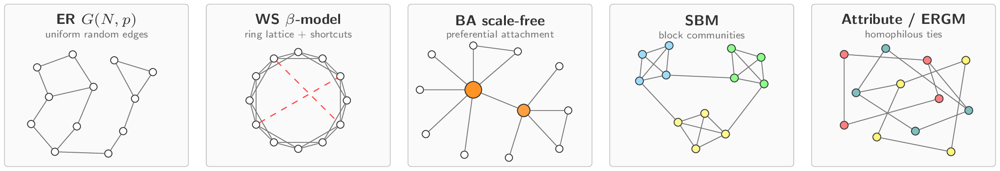
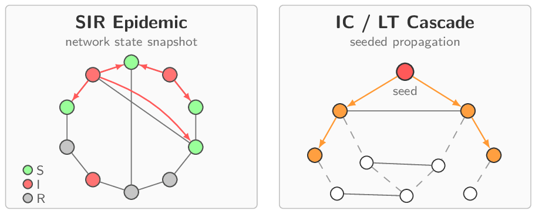
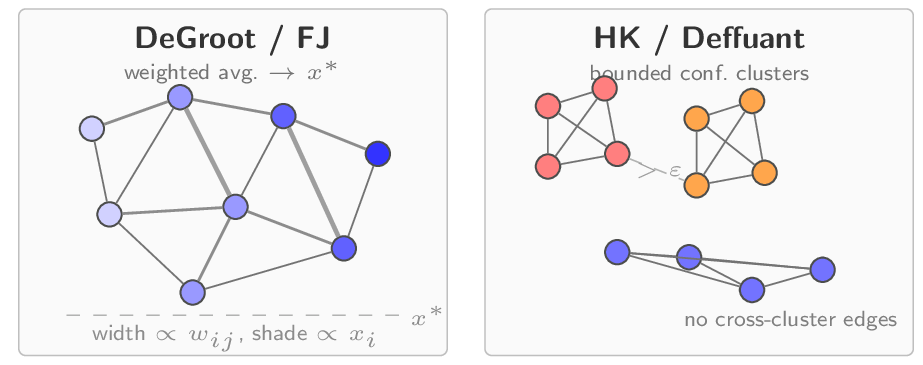
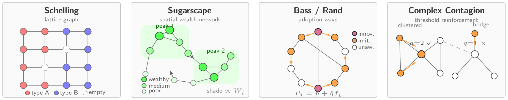
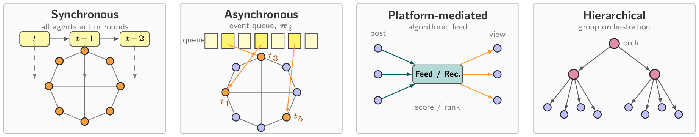

<!-- # Awesome Social Network Simulation: From Small Worlds to Agentic AI -->
# Awesome Social Network Simulation: From Random Graphs to Generative Agents

[](https://awesome.re)
[](https://github.com/tamlhp/awesome-sns/stargazers)


A collection of academic articles, published methodology, and datasets on the subject of **Social Network Simulation** from classical models to LLM-based agentic simulation.

<!-- This README follows the manuscript structure directly: five paradigm sections with one paper table per paradigm, followed by dedicated dataset/benchmark and evaluation-metric sections. The survey spans 97 papers across 1951-2026, five application domains, 38 implementations, 21 benchmarks/datasets, and 22 evaluation metrics. -->

<!-- The manuscript metadata currently still contains placeholder ACM DOI and venue fields, so this repository intentionally avoids unverified publication claims until a public paper link is finalized. -->

- [Taxonomy](#taxonomy)
- [Network Models](#network-models)
- [Information Diffusion](#information-diffusion)
- [Opinion Dynamics](#opinion-dynamics)
- [Rule-Based Agent-Based Models](#rule-based-agent-based-models)
- [LLM-Based Agentic Simulation](#llm-based-agentic-simulation)
- [Datasets and Benchmarks](#datasets-and-benchmarks)
- [Evaluation Metrics](#evaluation-metrics)
- [Contributing](#contributing)

<!-- ## Citation

If you use this repository, please cite the survey manuscript. A public DOI or finalized venue entry will be added once the paper metadata is finalized.

```bibtex
@misc{pham2026social-network-simulation,
  title = {A Survey of Social Network Simulation: From Small Worlds to Agentic AI},
  author = {Pham, Trinh and Nguyen, Quoc Viet Hung and Yin, Hongzhi and Nguyen, Thanh Tam},
  year = {2026},
  note = {Survey manuscript},
  url = {https://github.com/tamlhp/awesome-sns}
}
``` -->

## Taxonomy


The survey organizes the field into five paradigm families:

- **Network Models**: topology generation and structural analysis for synthetic social graphs.
- **Information Diffusion**: epidemic, cascade, influence, rumor, and control models.
- **Opinion Dynamics**: averaging, bounded-confidence, polarization, and echo-chamber models.
- **Rule-Based Agent-Based Models**: heterogeneous bottom-up simulation with explicit agent rules.
- **LLM-Based Agentic Simulation**: persona-grounded, memory-enabled, language-driven social agents.

Each table below is grounded in the manuscript citations and keeps the paper title, year, category, venue, and repository or project link visible for quick scanning. Paper titles link to official publication or publisher pages when confidently resolved.

## Network Models



| Paper | Year | Category | Venue | Code |
| --- | --- | --- | --- | --- |
| [Homophily in An Artificial Social Network of Agents Powered By Large Language Models](https://doi.org/10.21203/rs.3.rs-3096289/v1) | 2023 | Attribute-driven generators | Br. J. Psychol. | - |
| Network segregation in a model of misinformation and fact-checking | 2016 | Attribute-driven generators | JCSS | - |
| [Social network analysis and agent-based modeling in social epidemiology](https://doi.org/10.1186/1742-5573-9-1) | 2012 | Exponential random graph models (ERGMs) | Epidemiol. Perspect. Innov. | - |
| [Maximizing the Spread of Influence through a Social Network](https://doi.org/10.1145/956750.956769) | 2003 | Scale-Free Networks | KDD | - |
| [The Structure and Function of Complex Networks](https://doi.org/10.1137/s003614450342480) | 2003 | Random Graph Models | SIAM Review | - |
| [Emergence of Scaling in Random Networks](https://doi.org/10.1126/science.286.5439.509) | 1999 | Scale-Free Networks | Science | [NetworkX](https://networkx.org/documentation/stable/reference/generated/networkx.generators.random_graphs.barabasi_albert_graph.html) |
| [Collective dynamics of `small-world' networks](https://doi.org/10.1038/30918) | 1998 | Small-World Networks | Nature | [NetworkX](https://networkx.org/documentation/stable/reference/generated/networkx.generators.random_graphs.watts_strogatz_graph.html) |
| [Social Network Effects on the Extent of Innovation Diffusion: A Computer Simulation](https://doi.org/10.1287/orsc.8.3.289) | 1997 | Attribute-driven generators | Organ. Sci. | - |
| [The Small World Problem](https://doi.org/10.1037/e400002009-005) | 1967 | Small-World Networks | Psychology Today | - |
| [Diffusion of Innovations](https://books.google.com/books/about/Diffusion_of_Innovations.html?id=9U1K5LjUOwEC) | 1962 | Attribute-driven generators | Free Press | - |
| On Random Graphs I | 1959 | Random Graph Models | Publ. Math. Debrecen | [NetworkX](https://networkx.org/documentation/stable/reference/generated/networkx.generators.random_graphs.erdos_renyi_graph.html) |

## Information Diffusion



| Paper | Year | Category | Venue | Code |
| --- | --- | --- | --- | --- |
| [CSRT rumor spreading model based on complex network](https://doi.org/10.1002/int.22365) | 2021 | Epidemic Compartment Models | IJIS | - |
| [Dynamical behaviors and control measures of rumor-spreading model in consideration of the infected media and time delay](https://doi.org/10.1016/j.ins.2021.02.047) | 2021 | Competitive and Rumor Dynamics | Inf. Sci. | - |
| [Users' mobility enhances information diffusion in online social networks](https://doi.org/10.1016/j.ins.2020.07.061) | 2021 | Cascade Models: Independent Cascade and Linear Threshold | Inf. Sci. | - |
| [Rumor Spreading Model Considering Individual Activity and Refutation Mechanism Simultaneously](https://doi.org/10.1109/access.2020.2983249) | 2020 | Competitive and Rumor Dynamics | IEEE Access | - |
| [The stochastic evolution of a rumor spreading model with two distinct spread inhibiting and attitude adjusting mechanisms in a homogeneous social network](https://doi.org/10.1016/j.physa.2020.125321) | 2020 | Epidemic Compartment Models | Physica A | - |
| [Dynamical analysis of a IWSR rumor spreading model with considering the self-growth mechanism and indiscernible degree](https://doi.org/10.1016/j.physa.2019.04.176) | 2019 | Epidemic Compartment Models | Physica A | - |
| [Global dynamics analysis and control of a rumor spreading model in online social networks](https://doi.org/10.1016/j.physa.2019.04.139) | 2019 | Competitive and Rumor Dynamics | Physica A | - |
| [ILSR rumor spreading model with degree in complex network](https://doi.org/10.1016/j.physa.2019.121807) | 2019 | Epidemic Compartment Models | Physica A | - |
| Optimal Control of Rumor Spreading Model on Homogeneous Social Network with Consideration of Influence Delay of Thinkers | 2019 | Competitive and Rumor Dynamics | DEDS | - |
| [The impact of group propagation on rumor spreading in mobile social networks](https://doi.org/10.1016/j.physa.2018.04.038) | 2018 | Competitive and Rumor Dynamics | Physica A | - |
| [The Spread of True and False News Online](https://doi.org/10.1126/science.aap9559) | 2018 | Competitive and Rumor Dynamics | Science | - |
| [SEIR Model of Rumor Spreading in Online Social Network with Varying Total Population Size](https://doi.org/10.1088/0253-6102/68/4/545) | 2017 | Epidemic Compartment Models | Commun. Theor. Phys. | - |
| [Stability analysis and control models for rumor spreading in online social networks](https://doi.org/10.1142/s0129183117500619) | 2017 | Competitive and Rumor Dynamics | Int. J. Mod. Phys. C | - |
| Network segregation in a model of misinformation and fact-checking | 2016 | Competitive and Rumor Dynamics | JCSS | - |
| [A SIMULATION-BASED APPROACH TO ANALYZE THE INFORMATION DIFFUSION IN MICROBLOGGING ONLINE SOCIAL NETWORK](https://doi.org/10.1109/wsc.2013.6721550) | 2013 | Cascade Models: Independent Cascade and Linear Threshold | - | - |
| [How to Identify an Infection Source With Limited Observations](https://doi.org/10.1109/jstsp.2014.2315533) | 2013 | Cascade Models: Independent Cascade and Linear Threshold | IEEE JSTSP | - |
| [INFORMATION DIFFUSION IN FACEBOOK-LIKE SOCIAL NETWORKS UNDER INFORMATION OVERLOAD](https://doi.org/10.1142/s0129183113500472) | 2013 | Cascade Models: Independent Cascade and Linear Threshold | Int. J. Mod. Phys. C | - |
| [Information diffusion model for spread of misinformation in online social networks](https://doi.org/10.1109/icacci.2013.6637343) | 2013 | Competitive and Rumor Dynamics | ICACCI | - |
| [Measuring trustworthiness of information diffusion by risk discovery process in social networking services](https://doi.org/10.1007/s11135-013-9837-1) | 2013 | Competitive and Rumor Dynamics | Qual. Quant. | - |
| [Influential Neighbours Selection for Information Diffusion in Online Social Networks](https://doi.org/10.1109/icccn.2012.6289230) | 2012 | Cascade Models: Independent Cascade and Linear Threshold | ICCCN | - |
| [SIHR rumor spreading model in social networks](https://doi.org/10.1016/j.physa.2011.12.008) | 2012 | Epidemic Compartment Models | Physica A | - |
| A game theoretical approach to broadcast information diffusion in social networks | 2011 | Cascade Models: Independent Cascade and Linear Threshold | SpringSim | - |
| Simulation Investigation of Rumor Propagation in Microblogging Community | 2011 | Epidemic Compartment Models | Computer Engineering | - |
| [Maximizing the Spread of Influence through a Social Network](https://doi.org/10.1145/956750.956769) | 2003 | Cascade Models: Independent Cascade and Linear Threshold | KDD | - |
| [A Theory of Fads, Fashion, Custom, and Cultural Change as Informational Cascades](https://doi.org/10.1086/261849) | 1992 | Cascade Models: Independent Cascade and Linear Threshold | JPE | - |
| [Threshold Models of Collective Behavior](https://doi.org/10.1086/226707) | 1978 | Cascade Models: Independent Cascade and Linear Threshold | Am. J. Sociol. | - |
| [Diffusion of Innovations](https://books.google.com/books/about/Diffusion_of_Innovations.html?id=9U1K5LjUOwEC) | 1962 | Information Diffusion | Free Press | - |

## Opinion Dynamics



| Paper | Year | Category | Venue | Code |
| --- | --- | --- | --- | --- |
| [Extending the Hegselmann-Krause Model of Opinion Dynamics to include AI Oracles](https://arxiv.org/abs/2502.19701) | 2025 | Averaging Models: French-DeGroot and Friedkin-Johnsen | arXiv | [Code](https://github.com/allengrodrigo/HKAI) |
| [Opinion Dynamics and Collective Risk Perception: An Agent-Based Model of Institutional and Media Communication About Disasters](https://doi.org/10.18564/jasss.4479) | 2021 | Extensions and Modern Directions | JASSS | - |
| [Modeling Public Opinion Polarization in Group Behavior by Integrating SIRS-Based Information Diffusion Process](https://doi.org/10.1155/2020/4791527) | 2020 | Bounded Confidence: Deffuant and Hegselmann-Krause | Complexity | - |
| [Progressive Information Polarization in a Complex-Network Entropic Social Dynamics Model](https://doi.org/10.1109/access.2019.2902400) | 2019 | Bounded Confidence: Deffuant and Hegselmann-Krause | IEEE Access | - |
| Spiral of Silence in the Social Media Era: A Simulation Approach to the Interplay Between Social Networks and Mass Media | 2019 | Discrete and Stochastic Models | Communication Research | - |
| Opinion dynamics and bounded confidence: models, analysis and simulation | 2002 | Bounded Confidence: Deffuant and Hegselmann-Krause | JASSS | - |
| [Mixing beliefs among interacting agents](https://doi.org/10.1142/s0219525900000078) | 2000 | Bounded Confidence: Deffuant and Hegselmann-Krause | Adv. Complex Syst. | - |
| [Social Influence and Opinions](https://doi.org/10.1080/0022250x.1990.9990069) | 1990 | Averaging Models: French-DeGroot and Friedkin-Johnsen | J. Math. Sociol. | - |
| [Reaching a Consensus](https://doi.org/10.1080/01621459.1974.10480137) | 1974 | Averaging Models: French-DeGroot and Friedkin-Johnsen | JASA | - |
| [A formal theory of social power](https://doi.org/10.1037/h0046123) | 1956 | Averaging Models: French-DeGroot and Friedkin-Johnsen | Psychol. Rev. | - |

## Rule-Based Agent-Based Models



| Paper | Year | Category | Venue | Code |
| --- | --- | --- | --- | --- |
| [The (Mis)Information Game: A social media simulator](https://doi.org/10.3758/s13428-023-02153-x) | 2024 | Other ABM diffusion studies | Behav. Res. Methods | [Code](https://github.com/TheMisinformationGame/MisinformationGame) |
| [Effect of Seeding Strategy on the Efficiency of Brand Spreading in Complex Social Networks](https://doi.org/10.3389/fpsyg.2022.879274) | 2022 | Other ABM diffusion studies | Front. Psychol. | - |
| [Utilizing Python for Agent-Based Modeling: The Mesa Framework](https://doi.org/10.1007/978-3-030-61255-9_30) | 2020 | Implementation Frameworks | SCS | [Code](https://github.com/projectmesa/mesa) |
| WES: Agent-based User Interaction Simulation on Real Infrastructure | 2020 | Other ABM diffusion studies | ICSEW | - |
| [Agent Based Simulation of Bot Disinformation Maneuvers in Twitter](https://doi.org/10.1109/wsc40007.2019.9004942) | 2019 | Bot-driven disinformation | WSC | - |
| [Discrete Event System Specification-based framework for modeling and simulation of propagation phenomena in social networks: application to the information spreading in a multi-layer social network](https://doi.org/10.1177/0037549718776368) | 2019 | DEVS-based scheduling | SIMULATION | - |
| [Simulating and evaluating generative modeling and collaborative filtering in complex social networks](https://doi.org/10.65109/vmiv4632) | 2019 | Other ABM diffusion studies | CCS | - |
| [Policy simulation for promoting residential PV considering anecdotal information exchanges based on social network modelling](https://doi.org/10.1016/j.apenergy.2018.04.028) | 2018 | Other ABM diffusion studies | Appl. Energy | - |
| [A Survey of Agent-Based Approach of Complex Networks](https://doi.org/10.5455/ey.35900) | 2016 | Implementation Frameworks | Ekonomik Yaklasim | - |
| [Which Models Are Used in Social Simulation to Generate Social Networks? A Review of 17 Years of Publications in JASSS](https://doi.org/10.1109/wsc.2015.7408556) | 2015 | Implementation Frameworks | WSC | - |
| [An Agent-Based Model of Urgent Diffusion in Social Media](https://doi.org/10.2139/ssrn.2297167) | 2013 | Urgent diffusion | JASSS | - |
| [Complex adaptive systems modeling with Repast Simphony](https://doi.org/10.1186/2194-3206-1-3) | 2013 | Implementation Frameworks | Complex Adapt. Syst. Model. | [Code](https://github.com/Repast/repast.simphony) |
| [Large-Scale Multi-agent-Based Modeling and Simulation of Microblogging-Based Online Social Network](https://doi.org/10.1007/978-3-642-54783-6_2) | 2013 | Other ABM diffusion studies | mAbs | - |
| [Social network analysis and agent-based modeling in social epidemiology](https://doi.org/10.1186/1742-5573-9-1) | 2012 | Real-infrastructure simulation | Epidemiol. Perspect. Innov. | - |
| [Why Do People Use Social Media? Agent-Based Simulation and Population Dynamics Analysis of the Evolution of Cooperation in Social Media](https://doi.org/10.1109/wi-iat.2012.191) | 2012 | Other ABM diffusion studies | WI-IAT | - |
| [The Spread of Behavior in an Online Social Network Experiment](https://doi.org/10.1126/science.1185231) | 2010 | Complex contagion | Science | - |
| [MASON: A Multiagent Simulation Environment](https://doi.org/10.1177/0037549705058073) | 2005 | Implementation Frameworks | Simulation | [Code](https://github.com/eclab/mason) |
| [NetLogo](https://ccl.northwestern.edu/netlogo/) | 1999 | Implementation Frameworks | - | [Code](https://github.com/NetLogo/NetLogo) |
| [Collective dynamics of `small-world' networks](https://doi.org/10.1038/30918) | 1998 | Complex contagion | Nature | - |
| [Growing Artificial Societies: Social Science from the Bottom Up](https://mitpress.mit.edu/9780262550253/growing-artificial-societies/) | 1996 | Sugarscape | MIT Press | - |
| [Micromotives and Macrobehavior](https://wwnorton.com/books/9780393092677) | 1978 | Schelling segregation | W. W. Norton & Company | - |

## LLM-Based Agentic Simulation



| Paper | Year | Category | Venue | Code |
| --- | --- | --- | --- | --- |
| [Ahead of the Spread: Agent-Driven Virtual Propagation for Early Fake News Detection](https://arxiv.org/abs/2601.02750) | 2026 | Misinformation and bot dynamics | arXiv | [Code](https://github.com/Ironychen/AVOID) |
| [Towards Simulating Social Media Users with LLMs: Evaluating the Operational Validity of Conditioned Comment Prediction](https://doi.org/10.18653/v1/2026.wassa-1.16) | 2026 | Language-grounded cognition | - | [Code](https://github.com/nsschw/Conditioned-Comment-Prediction) |
| [VIRENA: Virtual Arena for Research, Education, and Democratic Innovation](https://arxiv.org/abs/2602.12207) | 2026 | Platform-level systems | - | - |
| [AgentSociety: Large-Scale Simulation of LLM-Driven Generative Agents Advances Understanding of Human Behaviors and Society](https://arxiv.org/abs/2502.08691) | 2025 | Toward artificial societies | arXiv | [Code](https://github.com/tsinghua-fib-lab/AgentSociety) |
| AI Metropolis: Scaling Large Language Model-based Multi-Agent Simulation with Out-of-order Execution | 2025 | Multi-Agent Coordination and Communication | MLSys | - |
| [Attention Mechanism for LLM-based Agents Dynamic Diffusion under Information Asymmetry](https://arxiv.org/abs/2502.13160) | 2025 | Platform-level systems | arXiv | - |
| [BotSim: LLM-Powered Malicious Social Botnet Simulation](https://doi.org/10.1609/aaai.v39i13.33575) | 2025 | Action spaces | AAAI | [Code](https://github.com/QQQQQQBY/BotSim) |
| [Can Generative Agent-Based Modeling Replicate the Friendship Paradox in Social Media Simulations?](https://doi.org/10.1145/3717867.3717895) | 2025 | Network structure emergence | WebSci | - |
| [Can LLMs Simulate Social Media Engagement? A Study on Action-Guided Response Generation](https://arxiv.org/abs/2502.12073) | 2025 | Language-grounded cognition | arXiv | - |
| [Can We Fix Social Media? Testing Prosocial Interventions using Generative Social Simulation](https://arxiv.org/abs/2508.03385) | 2025 | Prosocial interventions and political opinion | arXiv | [Code](https://github.com/cssmodels/prosocialinterventions) |
| Decoding Echo Chambers: LLM-Powered Simulations Revealing Polarization in Social Networks | 2025 | Echo-chamber metrics | COLING | [Code](https://github.com/ZongfangLiu/EchoChamberSim) |
| [Extending the Hegselmann-Krause Model of Opinion Dynamics to include AI Oracles](https://arxiv.org/abs/2502.19701) | 2025 | Reproducing and extending classical phenomena | arXiv | [Code](https://github.com/allengrodrigo/HKAI) |
| [GA-S3: Comprehensive Social Network Simulation with Group Agents](https://doi.org/10.18653/v1/2025.findings-acl.468) | 2025 | Multi-Agent Coordination and Communication | Findings of ACL | [Code](https://github.com/AI4SS/GAS-3) |
| [Large Language Model Driven Agents for Simulating Echo Chamber Formation](https://arxiv.org/abs/2502.18138) | 2025 | LLM as a drop-in replacement for classical update rules | arXiv | - |
| [LLM-Based Multi-Agent Systems are Scalable Graph Generative Models](https://doi.org/10.18653/v1/2025.findings-acl.78) | 2025 | Scalable agent coordination | ACL | [Code](https://github.com/graphagent/graphagent) |
| [MegaAgent: A Large-Scale Autonomous LLM-based Multi-Agent System Without Predefined SOPs](https://doi.org/10.18653/v1/2025.findings-acl.259) | 2025 | Scalable agent coordination | Findings of ACL | [Code](https://github.com/Xtra-Computing/MegaAgent) |
| [MTOS: A LLM-Driven Multi-topic Opinion Simulation Framework for Exploring Echo Chamber Dynamics](https://arxiv.org/abs/2510.12423) | 2025 | Multi-topic opinion dynamics with bounded confidence | arXiv | - |
| [Network Formation and Dynamics Among Multi-LLMs](https://doi.org/10.1093/pnasnexus/pgaf317) | 2025 | Emergent networks | PNAS Nexus | [Code](https://github.com/papachristoumarios/llm-network-formation) |
| [RumorSphere: A Framework for Million-scale Agent-based Dynamic Simulation of Rumor Propagation](https://arxiv.org/abs/2509.02172) | 2025 | Hybrid topology with adaptive role switching | - | - |
| [Simulating Rumor Spreading in Social Networks using LLM Agents](https://arxiv.org/abs/2502.01450) | 2025 | Platform-level systems | - | [Code](https://github.com/neerajas-group/rumors-in-multi-agent) |
| [User Behavior Simulation with Large Language Model-based Agents](https://doi.org/10.1145/3708985) | 2025 | Persona and Identity Grounding | TOIS | [Code](https://github.com/RUC-GSAI/YuLan-Rec) |
| Affordable Generative Agents | 2024 | Cost-efficient inference | TMLR | [Code](https://github.com/AffordableGenerativeAgents/Affordable-Generative-Agents) |
| [Can Large Language Model Agents Simulate Human Trust Behavior?](https://doi.org/10.52202/079017-0501) | 2024 | Emergent social phenomena | NeurIPS | [Code](https://github.com/camel-ai/agent-trust) |
| [ElectionSim: Massive Population Election Simulation Powered by Large Language Model Driven Agents](https://arxiv.org/abs/2410.20746) | 2024 | Persona and Identity Grounding | arXiv | [Code](https://github.com/amazingljy1206/ElectionSim) |
| Emergence of Social Norms in Generative Agent Societies: Principles and Architecture | 2024 | Norm emergence | IJCAI | [Code](https://github.com/sxswz213/CRSEC) |
| [Exploring Collaboration Mechanisms for LLM Agents: A Social Psychology View](https://doi.org/10.18653/v1/2024.acl-long.782) | 2024 | Multi-Agent Coordination and Communication | ACL | [Code](https://github.com/zjunlp/MachineSoM) |
| From skepticism to acceptance: simulating the attitude dynamics toward fake news | 2024 | Misinformation and bot dynamics | IJCAI | [Code](https://github.com/LiuYuHan31/FPS) |
| [Large Language Model-driven Multi-Agent Simulation for News Diffusion Under Different Network Structures](https://arxiv.org/abs/2410.15557) | 2024 | Exogenous static networks | arXiv | - |
| [Oasis: Open agent social interaction simulations with one million agents](https://arxiv.org/abs/2411.11581) | 2024 | Planning and Goal-Directed Action | arXiv | [Code](https://github.com/camel-ai/oasis) |
| [Project Sid: Many-agent simulations toward AI civilization](https://arxiv.org/abs/2411.00114) | 2024 | Toward artificial societies | arXiv | [Code](https://github.com/camel-ai/project-sid) |
| [Shall We Team Up: Exploring Spontaneous Cooperation of Competing LLM Agents](https://doi.org/10.18653/v1/2024.findings-emnlp.297) | 2024 | Emergent social phenomena | EMNLP | [Code](https://github.com/wuzengqing001225/SABM_ShallWeTeamUp) |
| [Simulating Opinion Dynamics with Networks of LLM-based Agents](https://doi.org/10.18653/v1/2024.findings-naacl.211) | 2024 | Multi-Agent Coordination and Communication | Findings of NAACL | [Code](https://github.com/yunshiuan/llm-agent-opinion-dynamics) |
| Sotopia: Interactive evaluation for social intelligence in language agents | 2024 | Emergent social phenomena | ICLR | [Code](https://github.com/sotopia-lab/sotopia) |
| [The Stepwise Deception: Simulating the Evolution from True News to Fake News with LLM Agents](https://doi.org/10.18653/v1/2025.emnlp-main.1330) | 2024 | Misinformation and bot dynamics | EMNLP | [Code](https://github.com/LiuYuHan31/FUSE) |
| [Unveiling the Truth and Facilitating Change: Towards Agent-based Large-scale Social Movement Simulation](https://doi.org/10.18653/v1/2024.findings-acl.285) | 2024 | Prosocial interventions and political opinion | ACL | [Code](https://github.com/xymou/HiSim) |
| [Very Large-Scale Multi-Agent Simulation in AgentScope](https://arxiv.org/abs/2407.17789) | 2024 | Cost-efficient inference | arXiv | [Code](https://github.com/modelscope/agentscope) |
| [Y Social: an LLM-powered Social Media Digital Twin](https://arxiv.org/abs/2409.07925) | 2024 | Memory: Episodic, Semantic, and Reflective | arXiv | [Code](https://github.com/YSocialTwin/YSocial) |
| [Emergence of Scale-Free Networks in Social Interactions among Large Language Models](https://arxiv.org/abs/2312.06619) | 2023 | Emergent networks | arXiv | - |
| [Generative agents: Interactive simulacra of human behavior](https://doi.org/10.1145/3586183.3606763) | 2023 | Agent Architecture for Social Simulation | UIST | [Code](https://github.com/joonspk-research/generative_agents) |
| [Homophily in An Artificial Social Network of Agents Powered By Large Language Models](https://doi.org/10.21203/rs.3.rs-3096289/v1) | 2023 | Emergent networks | Br. J. Psychol. | - |
| [Humanoid Agents: Platform for Simulating Human-like Generative Agents](https://doi.org/10.18653/v1/2023.emnlp-demo.15) | 2023 | Persona and Identity Grounding | EMNLP | [Code](https://github.com/HumanoidAgents/HumanoidAgents) |
| [S3: Social-network Simulation System with Large Language Model-Empowered Agents](https://arxiv.org/abs/2307.14984) | 2023 | Memory: Episodic, Semantic, and Reflective | arXiv | - |
| [Simulating Social Media Using Large Language Models to Evaluate Alternative News Feed Algorithms](https://arxiv.org/abs/2310.05984) | 2023 | Multi-Agent Coordination and Communication | arXiv | - |
| [Theory of Mind for Multi-Agent Collaboration via Large Language Models](https://doi.org/10.18653/v1/2023.emnlp-main.13) | 2023 | Planning and Goal-Directed Action | EMNLP | [Code](https://github.com/romanlee6/multi_LLM_comm) |
| [War and peace (waragent): Large language model-based multi-agent simulation of world wars](https://arxiv.org/abs/2311.17227) | 2023 | Planning and Goal-Directed Action | arXiv | [Code](https://github.com/agiresearch/WarAgent) |
| [Social Simulacra: Creating Populated Prototypes for Social Computing Systems](https://doi.org/10.1145/3526113.3545616) | 2022 | Agent Architecture for Social Simulation | UIST | - |
| [Growing Artificial Societies: Social Science from the Bottom Up](https://mitpress.mit.edu/9780262550253/growing-artificial-societies/) | 1996 | Toward artificial societies | MIT Press | - |
| [Micromotives and Macrobehavior](https://wwnorton.com/books/9780393092677) | 1978 | Norm emergence | W. W. Norton & Company | - |

## Datasets and Benchmarks

The survey catalogues 21 published datasets and benchmarks for validating structural fidelity, temporal dynamics, behavioral realism, and platform-scale effects. The table below highlights the main benchmark families surfaced in the paper appendix.

<table>
  <thead>
    <tr>
      <th>Category</th>
      <th>Benchmark / Dataset</th>
      <th>Platform</th>
      <th>Evaluation Task</th>
      <th>Used In</th>
    </tr>
  </thead>
  <tbody>
    <tr>
      <td rowspan="3">Political Behavior and Elections</td>
      <td><a href="https://github.com/amazingljy1206/ElectionSim">PPE Benchmark</a></td>
      <td>Twitter</td>
      <td>Voter preference prediction</td>
      <td>ElectionSim</td>
    </tr>
    <tr>
      <td>ANES 2020</td>
      <td>Survey</td>
      <td>Demographic calibration</td>
      <td>ElectionSim</td>
    </tr>
    <tr>
      <td>ITA-ELECTION-22</td>
      <td>Twitter</td>
      <td>Political conversation simulation</td>
      <td>SOSMC</td>
    </tr>
    <tr>
      <td rowspan="5">User Behavior and Engagement</td>
      <td>Vaccination Engagement</td>
      <td>X</td>
      <td>Action-guided engagement</td>
      <td>CLSSM</td>
    </tr>
    <tr>
      <td>CCP-DE</td>
      <td>X</td>
      <td>Comment prediction (DE)</td>
      <td>TSSMU</td>
    </tr>
    <tr>
      <td>CCP-EN</td>
      <td>X</td>
      <td>Comment prediction (EN)</td>
      <td>TSSMU</td>
    </tr>
    <tr>
      <td>CCP-LU</td>
      <td>RTL</td>
      <td>Comment prediction (LU)</td>
      <td>TSSMU</td>
    </tr>
    <tr>
      <td><a href="https://github.com/YSocialTwin/YSocial">Y Social traces</a></td>
      <td>Synthetic</td>
      <td>Digital-twin validation</td>
      <td>Y Social</td>
    </tr>
    <tr>
      <td rowspan="4">Misinformation and Rumor</td>
      <td>Rumor Event Suite</td>
      <td>Twitter</td>
      <td>Temporal rumor dynamics</td>
      <td>RumorSphere</td>
    </tr>
    <tr>
      <td><a href="https://github.com/QQQQQQBY/BotSim">BotSim-24</a></td>
      <td>Reddit</td>
      <td>Adversarial bot simulation</td>
      <td>BotSim</td>
    </tr>
    <tr>
      <td><a href="https://github.com/LiuYuHan31/FPS">FPS Fake-News</a></td>
      <td>Synthetic</td>
      <td>Attitude dynamics to fake news</td>
      <td>FPS</td>
    </tr>
    <tr>
      <td><a href="https://github.com/LiuYuHan31/FUSE">FUSE Mutation</a></td>
      <td>Synthetic</td>
      <td>Stepwise news deception</td>
      <td>FUSE</td>
    </tr>
    <tr>
      <td rowspan="2">Controversial-Topic Propagation</td>
      <td>Gender Discrimination</td>
      <td>Weibo</td>
      <td>Emotion and event propagation</td>
      <td>S3</td>
    </tr>
    <tr>
      <td>Nuclear Energy</td>
      <td>Weibo</td>
      <td>Attitude-change propagation</td>
      <td>S3</td>
    </tr>
    <tr>
      <td rowspan="3">Opinion Dynamics and Echo Chambers</td>
      <td><a href="https://github.com/yunshiuan/llm-agent-opinion-dynamics">LLM Opinion Dynamics</a></td>
      <td>Synthetic</td>
      <td>Opinion convergence</td>
      <td>SODNL</td>
    </tr>
    <tr>
      <td><a href="https://github.com/camel-ai/oasis">OASIS Twitter-like</a></td>
      <td>Synthetic</td>
      <td>Group polarization</td>
      <td>OASIS</td>
    </tr>
    <tr>
      <td><a href="https://github.com/camel-ai/oasis">OASIS Reddit-like</a></td>
      <td>Synthetic</td>
      <td>Herd effect and misinformation</td>
      <td>OASIS</td>
    </tr>
    <tr>
      <td>Network Structure</td>
      <td><a href="https://snap.stanford.edu/data/">SNAP Collection</a></td>
      <td>Multi</td>
      <td>Network analysis and topology generation</td>
      <td>NetworkX, igraph</td>
    </tr>
  </tbody>
</table>

## Evaluation Metrics

The survey groups 22 evaluation metrics into seven core evaluation goals. The table below summarizes the metric families that recur throughout the paper.

<table>
  <thead>
    <tr>
      <th>Category</th>
      <th>Metric</th>
      <th>Formula / Description</th>
      <th>Usage</th>
    </tr>
  </thead>
  <tbody>
    <tr>
      <td rowspan="4">Structural Fidelity</td>
      <td>Degree distribution</td>
      <td><code>P(k) = Pr(deg(v)=k)</code>; scale-free often fits <code>P(k) ∝ k^{-γ}</code>.</td>
      <td>Validates topology realism (heavy-tail, hubs) of generated networks.</td>
    </tr>
    <tr>
      <td>Clustering coefficient</td>
      <td>Local: <code>C_i = 2T_i / (k_i (k_i-1))</code>, where <code>T_i</code> is triangles incident to node <code>i</code>.</td>
      <td>Measures triadic closure; high clustering indicates community / small-world structure.</td>
    </tr>
    <tr>
      <td>Average path length</td>
      <td><code>L = (2/(N(N-1))) · Σ_{i&lt;j} d(i,j)</code>.</td>
      <td>Checks global reachability and small-world effect (<code>L</code> typically grows like <code>log N</code>).</td>
    </tr>
    <tr>
      <td>Assortativity coefficient</td>
      <td>Pearson correlation of endpoint attributes across edges; degree-assortativity often reported as <code>r</code>.</td>
      <td>Quantifies homophily/heterophily (e.g., <code>r &gt; 0</code> assortative, <code>r &lt; 0</code> disassortative).</td>
    </tr>
    <tr>
      <td rowspan="4">Dynamic and Temporal Fidelity</td>
      <td>Pearson correlation</td>
      <td><code>r = cov(x, y) / (σ_x σ_y)</code>.</td>
      <td>Tests temporal synchronization between simulated and empirical trajectories.</td>
    </tr>
    <tr>
      <td>DTW distance</td>
      <td><code>DTW(X,Y) = min_π Σ_{(i,j)∈π} δ(x_i, y_j)</code> over warping paths <code>π</code>.</td>
      <td>Sequence alignment with time-warping; used for cascade / activity curve matching.</td>
    </tr>
    <tr>
      <td>DeltaBias</td>
      <td><code>ΔBias = Bias(sim) - Bias(emp)</code> (or absolute gap).</td>
      <td>Measures directional error in simulated bias vs. an empirical baseline.</td>
    </tr>
    <tr>
      <td>DeltaDiversity</td>
      <td><code>ΔDiversity = Div(sim) - Div(emp)</code> (or absolute gap).</td>
      <td>Evaluates whether content / exposure diversity is preserved during propagation.</td>
    </tr>
    <tr>
      <td rowspan="4">Opinion and Polarization</td>
      <td>Polarization <code>P_z</code></td>
      <td>Variance proxy: <code>P_z = (1/N) · Σ_i (x_i - x̄)^2</code>.</td>
      <td>Tracks population-level opinion dispersion (convergence vs. fragmentation).</td>
    </tr>
    <tr>
      <td>Global disagreement</td>
      <td>Edge-averaged distance, e.g. <code>GD = (1/|E|) · Σ_{(i,j)∈E} |x_i - x_j|</code>.</td>
      <td>Captures cross-edge heterogeneity (echo-chamber separation yields higher disagreement).</td>
    </tr>
    <tr>
      <td>Neighbour correlation index (NCI)</td>
      <td><code>NCI = (1/|E|) · Σ_{(i,j)∈E} 1[|x_i - x_j| &lt; ε]</code>.</td>
      <td>Quantifies local homogeneity (fraction of “similar” neighbors under tolerance <code>ε</code>).</td>
    </tr>
    <tr>
      <td>Spectral gap</td>
      <td>Often reported via the second eigenvalue, e.g. <code>gap = 1 - |λ_2(W)|</code> for mixing matrix <code>W</code>.</td>
      <td>Measures convergence/mixing speed; larger gap typically implies faster consensus.</td>
    </tr>
    <tr>
      <td rowspan="3">Diffusion and Influence</td>
      <td>Reproduction number <code>R_0</code></td>
      <td>Basic ratio form (SIR-style): <code>R_0 = β/γ</code> (infection rate over recovery rate).</td>
      <td>Checks whether diffusion is supercritical (<code>R_0 &gt; 1</code>) or dies out (<code>R_0 &lt; 1</code>).</td>
    </tr>
    <tr>
      <td>Influence spread</td>
      <td>Expected activated count: <code>σ(S) = E[|Activated(S)|]</code> from seed set <code>S</code>.</td>
      <td>Evaluates seed effectiveness and reach under IC/LT-style cascade processes.</td>
    </tr>
    <tr>
      <td>Cascade size</td>
      <td>Final activated / infected count (or its distribution) over runs.</td>
      <td>Measures total reach of an information cascade and validates diffusion intensity.</td>
    </tr>
<tr>
      <td rowspan="4">Behavioral Alignment</td>
      <td>Micro-F1</td>
      <td><code>F1 = 2PR/(P+R)</code> computed with micro-aggregated counts.</td>
      <td>Per-instance prediction quality (e.g., stance/action classification, voter prediction).</td>
    </tr>
    <tr>
      <td>Action distribution divergence</td>
      <td>KL: <code>D_KL(P||Q)=Σ_a P(a) log(P(a)/Q(a))</code>; JS is a symmetric alternative.</td>
      <td>Checks whether simulated engagement/action frequencies match real logs.</td>
    </tr>
    <tr>
      <td>Cosine similarity</td>
      <td><code>cos(e_a,e_b) = (e_a·e_b)/(||e_a||·||e_b||)</code> for embedding vectors.</td>
      <td>Semantic alignment between simulated content and reference content.</td>
    </tr>
    <tr>
      <td>State-level accuracy</td>
      <td><code>Acc = (# correct states)/(# total states)</code>.</td>
      <td>Validates discrete outcomes (e.g., election results, topic/state transitions).</td>
    </tr>
<tr>
      <td rowspan="3">Efficiency and Scalability</td>
      <td>Confusion index</td>
      <td>Heuristic for “hard” cases (model-dependent; typically combines uncertainty and disagreement signals).</td>
      <td>Enables selective LLM invocation (route easy steps to cheap rules; hard steps to LLMs).</td>
    </tr>
    <tr>
      <td>Token reduction</td>
      <td><code>TR = Tokens(baseline) / Tokens(method)</code> (or relative % reduction).</td>
      <td>Quantifies compute savings from hybrid scheduling, caching, summarization, etc.</td>
    </tr>
    <tr>
      <td>Wall-clock cost</td>
      <td>Measured runtime / $ cost per simulation step or per episode.</td>
      <td>Assesses feasibility at scale (million-agent runs, long horizons, repeated trials).</td>
    </tr>
<tr>
      <td>Adversarial Robustness</td>
      <td>Detector accuracy drop</td>
      <td><code>ΔAcc = Acc(clean) - Acc(attack)</code>.</td>
      <td>Stress-tests defenses against LLM-driven bots and adversarial coordination strategies.</td>
    </tr>
  </tbody>
</table>

## Disclaimer

Feel free to contact us if you have any queries or exciting news on social network simulation. In addition, we welcome all researchers to contribute to this repository and further contribute to the knowledge of social network simulation fields. It would be great if contributions keep the repository aligned with the survey taxonomy

If you have some other related references, please feel free to create a Github issue with the paper information. We will glady update the repos according to your suggestions. (You can also create pull requests, but it might take some time for us to do the merge)

<!-- ## Contributing

Contributions are welcome if they keep the repository aligned with the survey taxonomy.

- Add papers under the correct paradigm section and keep the `Paper`, `Year`, `Category`, and `Source` columns populated.
- Add datasets with platform and evaluation-task details, and add metrics with a clear description of what they measure.
- Prefer official paper, code, and dataset links when available.
- Do not add unverified publication status, DOI claims, or speculative code links. -->


-----------
**Backup Statistics**


